# School_District_Analysis.
## Overview of the school district analysis:
### Purpose
The school board has notified Maria that the data shows evidence of academic dihonesty; specifically, reading and math grades for Thomas High School ninth graders appear to have been altered. The board has tunerd to Maria for help, Maria asks us to replace the math and reading score for Thomas High School with NaNs while keeping the rest of the data intact, the purpose of this challenege is to replace the ninth grade reading and math score and then repeat the analysis done through out the unit. This well helps us to see how the district summary is affected and how it also affects the school summary.
## Results
### How is the district summary affected?
* Before cleaning the data

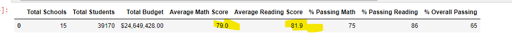

* After cleaning the data

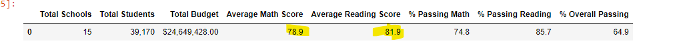

After Analyzing the data, it is shown that the average math score and the average reading score change but not significantly, not enough to make a conclusions of academic dishonesty.

### How is the school summary affected?
* Before cleaning the data

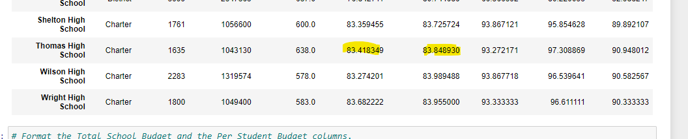

* After cleaning the data

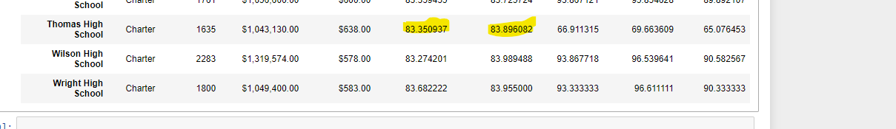

After Analyzing the data, it is shown that the average math score and the average reading score change but not significantly, not enough to make a conclusions of academic dishonesty.

### How does replacing the ninth graders’ math and reading scores affect Thomas High School’s performance relative to the other schools?

When looking at the ranking of students percentage that passed reading, we see that Thomas Highschool dropped from the first place to the third place. when analyzing the same table, we can also see that its ranking regarding the number of students that passed math did not change.

### How does replacing the ninth-grade scores affect the following:

no significant stadistical changes are detected on the analysis shown below.

#### Math and reading scores by grade
before cleaning the Data
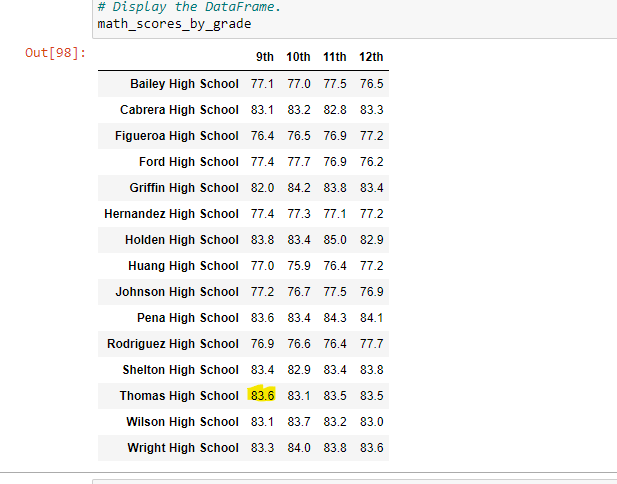
after cleaning the data
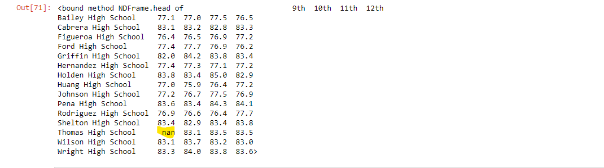
#### Scores by school spending
before cleaning the Data
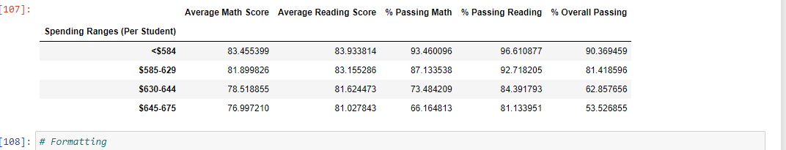
after cleaning the data
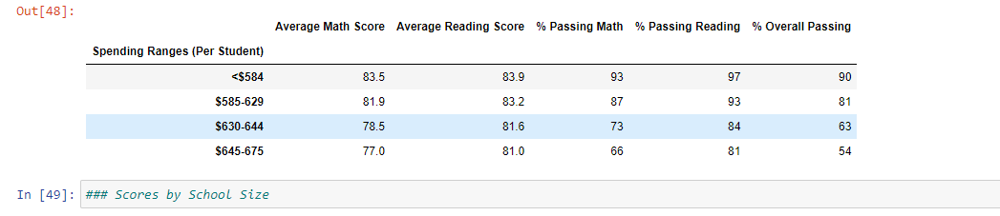
#### Scores by school size
before cleaning the Data
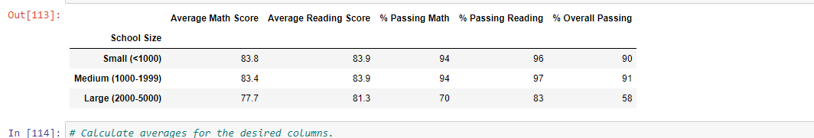
after cleaning the data
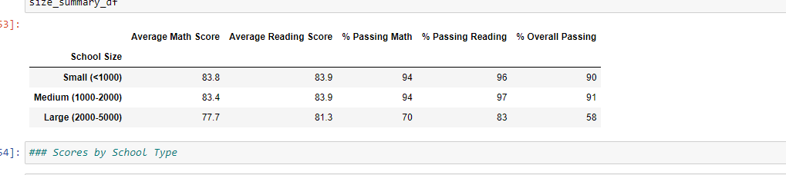
#### Scores by school type
before cleaning the Data
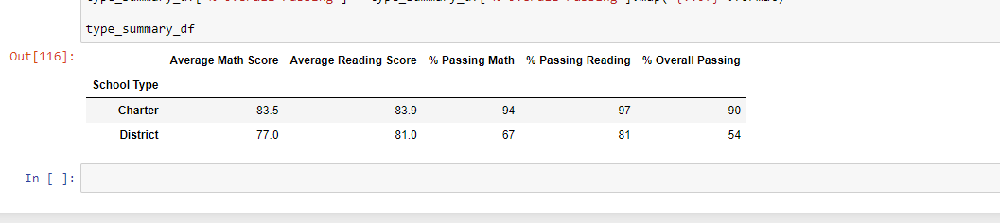
after cleaning the data
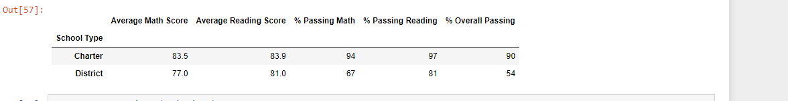

## Summary

1. Thomas high school dropped in the ranking of students who have passed reading, this is important in the real world if the budget directed to the school is dependant of this metric. 
2. there is Nan for grade 9th students from Thomas High school when it comes to math scores by grade
3. The average math and reading scores changed between the two analysis, it is not stadistically significant but there is a change.
4. the overall percentage passing grade for the distric changed, we could say that these numbers are more accurate when building a report

